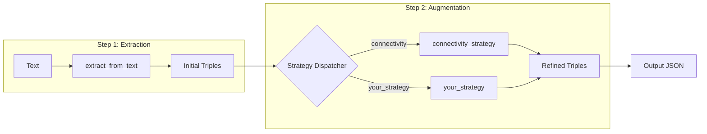

# Add Augmentation Strategy: New Graph Refinement

This skill guides you through adding a new augmentation strategy to the `src/builder/` module.

## Architecture Overview



**Key Files:**
- [augmentation.py](file:///app/src/builder/augmentation.py) - Strategy Protocol, Registry, and implementations.
- [__init__.py](file:///app/src/builder/__init__.py) - Public exports.

---

## Step 1: Understand the Protocol

All strategies must conform to the `AugmentationStrategy` Protocol:

```python
class AugmentationStrategy(Protocol):
    def __call__(
        self,
        client: BaseLLMClient,
        domain: KnowledgeDomain,
        text: str,
        triples: list[Triple],
        **kwargs: Any  # Strategy-specific parameters
    ) -> tuple[list[Triple], dict[str, Any]]:
        """Returns (refined_triples, metadata)."""
        ...
```

> [!NOTE]
> Strategy-specific parameters (e.g., `max_iterations`) are passed via `**kwargs`. Define and document them in your strategy's docstring.

---

## Step 2: Implement Your Strategy

Add your strategy function to `src/builder/augmentation.py`:

```python
from .augmentation import (
    register_strategy,
    _build_graph_from_triples,  # Converts list[Triple] to NetworkX DiGraph
    _format_example_for_client,  # Transforms domain examples to langextract format
)
from ..clients import BaseLLMClient, LLMClientError
from ..domains import KnowledgeDomain, Triple, InferenceType
from pydantic import ValidationError


@register_strategy("enrichment")
def enrichment_strategy(
    client: BaseLLMClient,
    domain: KnowledgeDomain,
    text: str,
    triples: list[Triple],
    *,
    max_iterations: int = 3,
    temperature: float = 0.0,
    **kwargs: Any
) -> tuple[list[Triple], dict[str, Any]]:
    """Enrichment augmentation: Add missing entity attributes.
    
    Args:
        client: LLM client for generation
        domain: Knowledge domain with prompts/examples
        text: Source text to analyze
        triples: Initial triples from extraction
        max_iterations: Max refinement iterations (default: 3)
        temperature: Sampling temperature for LLM (0.0 = deterministic)
        
    Returns:
        Tuple of (enriched_triples, metadata)
    """
    # 1. Fetch strategy-specific resources from domain
    augmentation = domain.get_augmentation("enrichment")
    aug_prompt = augmentation.prompt
    aug_examples = [_format_example_for_client(ex) for ex in augmentation.examples]
    
    all_triples = list(triples)  # Copy to avoid mutation
    metadata = {"strategy": "enrichment", "iterations": [], "partial_result": False}

    # 2. Iteration loop with error preservation
    for i in range(max_iterations):
        try:
            # Strategy-specific logic here
            new_triples_raw = client.generate_json(
                text=aug_prompt.format(text=text, triples=all_triples),
                prompt_description="Enrich entities with missing attributes",
                format_type=Triple,
                temperature=temperature
            )
            
            new_triples = []
            for t_raw in new_triples_raw:
                try:
                    t_dict = t_raw if isinstance(t_raw, dict) else t_raw.model_dump()
                    t_dict["inference"] = InferenceType.CONTEXTUAL
                    new_triples.append(Triple(**t_dict))
                except ValidationError as e:
                    print(f"Warning: Skipping invalid triple: {e}")
                    continue
            
            all_triples.extend(new_triples)
            metadata["iterations"].append({
                "iteration": i + 1,
                "new_triples": len(new_triples),
                "status": "success"
            })
            
        except LLMClientError as e:
            # Preserve partial results on failure
            metadata["iterations"].append({
                "iteration": i + 1,
                "status": "failed",
                "error": str(e)
            })
            metadata["partial_result"] = True
            break

    return all_triples, metadata
```

---

## Step 3: Create Domain Resources

Add the prompts and examples for your strategy:

```text
src/domains/<domain>/augmentation/enrichment/
├── prompt.txt
└── examples.json
```

**`examples.json` structure:**
```json
[
  {
    "input": {"text": "...", "entities": ["..."]},
    "output": [{"head": "...", "relation": "...", "tail": "..."}]
  }
]
```

---

## Step 4: Add CLI Subcommand

Update `src/__main__.py` to expose your strategy:

```python
@augment_app.command("enrichment")
def augment_enrichment(
    input_file: Path = typer.Option(..., "--input", "-i", exists=True),
    output_dir: Path = typer.Option("outputs/kg_extraction", "--output-dir", "-o"),
    domain: str = typer.Option(..., "--domain", "-d"),
    max_iterations: int = typer.Option(3, "--max-iterations"),
    client: ClientType = typer.Option(ClientType.GEMINI, "--client", "-c"),
    # ... see augment_connectivity for full option list
):
    """Enrichment augmentation: Add missing entity attributes."""
    from .builder import extract_connected_graph
    from .datasets import load_records
    from .domains import get_domain
    
    records = load_records(input_file, text_field="text", id_field="id")
    domain_obj = get_domain(domain)
    config = _build_client_config(client, model=None, api_key=None, base_url=None, ...)
    llm_client = ClientFactory.create(config)
    
    json_dir = output_dir / "extracted_json"
    json_dir.mkdir(parents=True, exist_ok=True)
    
    for record in records:
        record_id = str(record["id"])
        triples, metadata = extract_connected_graph(
            client=llm_client,
            domain=domain_obj,
            text=record["text"],
            augmentation_strategy="enrichment",
            max_iterations=max_iterations
        )
        
        output_path = json_dir / f"{record_id}.json"
        with open(output_path, "w") as f:
            json.dump([t.model_dump() for t in triples], f, indent=2)
        
        console.print(f"Saved {len(triples)} triples to {output_path}")
```

> [!TIP]
> For a complete reference, see the existing `augment_connectivity` command in [__main__.py](file:///app/src/__main__.py).

---

## Step 5: Verification

### 5.1 Check Registration

```bash
python -c "from src.builder import list_strategies; print(list_strategies())"
# Output: ['connectivity', 'enrichment']
```

### 5.2 Unit Test

```python
import pytest
from unittest.mock import MagicMock
from src.builder.augmentation import enrichment_strategy
from src.domains import Triple

def test_enrichment_strategy():
    # Arrange
    mock_client = MagicMock()
    mock_client.generate_json.return_value = [
        {"head": "A", "relation": "has_attr", "tail": "B"}
    ]
    mock_domain = MagicMock()
    mock_domain.get_augmentation.return_value.prompt = "Test prompt"
    mock_domain.get_augmentation.return_value.examples = []
    
    initial_triples = [Triple(head="X", relation="r", tail="Y")]
    
    # Act
    result_triples, metadata = enrichment_strategy(
        client=mock_client,
        domain=mock_domain,
        text="Sample text",
        triples=initial_triples,
        max_iterations=1
    )
    
    # Assert
    assert len(result_triples) > len(initial_triples)
    assert metadata["strategy"] == "enrichment"
    assert metadata["partial_result"] is False


### 5.3 Integration Test

```python
def test_enrichment_integration():
    """End-to-end test with real domain and mock client."""
    from src.domains import get_domain
    from src.builder.augmentation import enrichment_strategy
    from unittest.mock import MagicMock
    
    # Use real domain with test resources
    domain = get_domain("default")
    
    mock_client = MagicMock()
    mock_client.generate_json.return_value = [
        {"head": "NewEntity", "relation": "attr", "tail": "Value"}
    ]
    
    initial = [Triple(head="A", relation="r", tail="B")]
    
    result, metadata = enrichment_strategy(
        client=mock_client,
        domain=domain,
        text="Sample text about A and B.",
        triples=initial,
        max_iterations=1
    )
    
    # Verify augmented triples are marked as contextual
    augmented = [t for t in result if t not in initial]
    assert all(t.inference == InferenceType.CONTEXTUAL for t in augmented)
```

---

## Key Principles

| Principle | Description | Example |
|-----------|-------------|---------|
| **Iteration Resilience** | Wrap LLM calls in `try-except LLMClientError`. On failure, set `metadata["partial_result"] = True` and `break`. | See Step 2 code. |
| **Type Safety** | Augmented triples must have `inference=InferenceType.CONTEXTUAL`. | `t_dict["inference"] = InferenceType.CONTEXTUAL` |
| **Stateless Logic** | Do not store state between records. Each call is independent. | Copy input triples: `all_triples = list(triples)` |
| **Metadata Contract** | Always return `{"strategy": "...", "iterations": [...], "partial_result": bool}`. | See Step 2 `metadata`. |

---

## Error Handling Reference

| Exception | When | Action |
|-----------|------|--------|
| `LLMClientError` | API failure | Log, set `partial_result=True`, break loop |
| `ValidationError` | Triple parsing | Log warning, skip triple, continue |
| `DomainResourceError` | Missing prompt/examples | Fail loudly (don't catch) |

---

## Comparison Checklist

Before submitting, verify your strategy matches the `add-domain` skill quality:

- [ ] Complete, runnable code example
- [ ] Architecture diagram
- [ ] CLI integration with all options
- [ ] Unit test with mocks
- [ ] Error handling for specific exceptions
- [ ] Metadata structure documented
- [ ] Principles table with concrete examples
