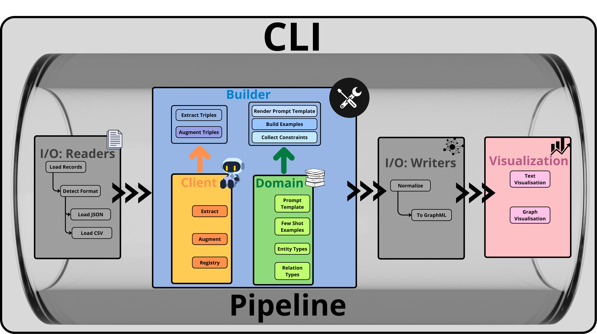
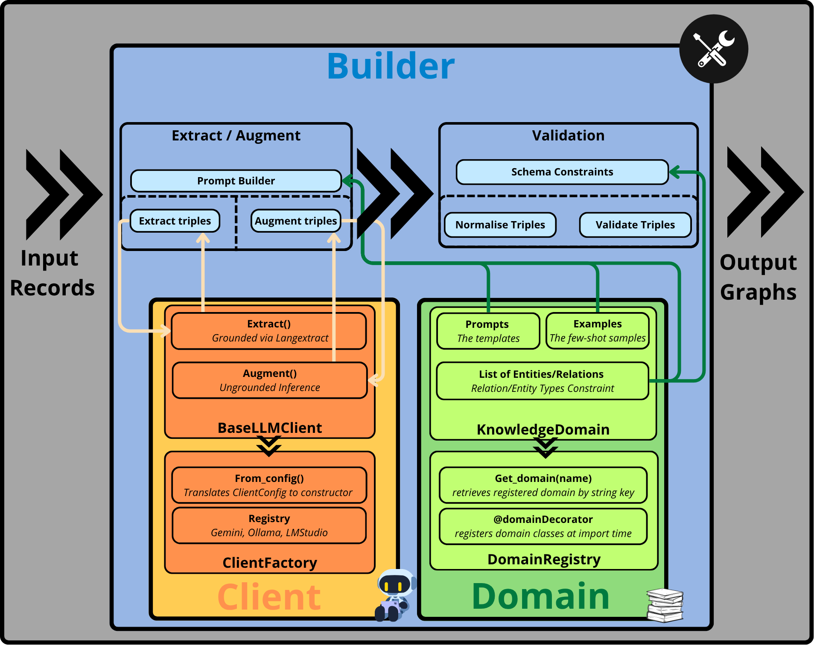

# Knowledge Graph Builder (KGB)

A modular system for extracting knowledge graphs from text using multiple LLM backends. Supports **Gemini API**, **Ollama**, and **LM Studio** with a unified client abstraction layer.

## Features

- **Multi-Backend LLM Support** — Gemini API (cloud), Ollama (local), LM Studio (local)
- **Knowledge Graph Extraction** — Structured triples (head-relation-tail) with source grounding via [langextract](https://github.com/langextract/langextract)
- **Graph Augmentation** — Iterative strategies to bridge disconnected components
- **Origin Tracking** — Every triple tagged as `explicit` (extracted) or `contextual` (augmented)
- **Interactive Visualizations** — Cytoscape.js interactive network graphs with node dragging, search/filter, and context menus; entity text highlighting
- **Domain System** — Customizable prompts, examples, and schema constraints per knowledge domain
- **Pipeline Orchestration** — YAML-driven or flag-based multi-step pipelines
- **Multiple I/O Formats** — JSONL, JSON, CSV input; GraphML output

---

## Quick Start

### Installation

```bash
# Using Makefile (recommended)
make install

# Or manually
python3 -m venv .venv
source .venv/bin/activate
pip install -e .
```

Requires **Python 3.11+**.

### Prerequisites

| Backend | Requirement |
|---------|-------------|
| Gemini | API key from [Google AI Studio](https://aistudio.google.com/app/apikey) — set `GOOGLE_API_KEY` in `.env` |
| Ollama | [Ollama](https://ollama.ai/) running locally (`ollama serve`) |
| LM Studio | [LM Studio](https://lmstudio.ai/) with server enabled and model loaded |

### Basic Usage

```bash
# Interactive mode (REPL)
kgb

# One-shot extraction
kgb extract --input data.jsonl --domain legal --client gemini

# Full pipeline via script
bash scripts/test_single_extraction.sh
```

---

## Pipeline Steps

The typical workflow follows four steps:

```
Text → Extract → Augment → Convert → Visualize
         ↓          ↓          ↓          ↓
       JSON      JSON+      GraphML     HTML
     (explicit) (contextual)
```

### Step 1: Extract Triples

Extracts source-grounded triples using langextract. Each triple has character positions in the original text.

```bash
kgb extract \
  --input data/legal/legal_background.jsonl \
  --domain legal \
  --client gemini \
  --output-dir outputs/run
```

### Step 2: Augment Connectivity

Generates bridging triples (tagged `contextual`) to connect disconnected graph components.

```bash
kgb augment connectivity \
  --input data/legal/legal_background.jsonl \
  --domain legal \
  --client gemini \
  --output-dir outputs/run \
  --max-disconnected 1 \
  --max-iterations 5
```

### Step 3: Convert to GraphML

```bash
kgb convert --input outputs/run/extracted_json --output outputs/run/graphml
```

### Step 4: Visualize

```bash
# Network topology (nodes colored by origin: Extracted/Augmented/Both)
kgb visualize network --input outputs/run/graphml --output outputs/run/network_viz

# Entity highlighting in source text
kgb visualize extraction \
  --input data/legal/legal_background.jsonl \
  --triples outputs/run/extracted_json \
  --output outputs/run/extraction_viz
```

### Full Pipeline (YAML)

```bash
kgb run-pipeline --config kgb/pipeline/configs/legal_ollama.yaml
```

Or with flags:

```bash
kgb run-pipeline --input data.jsonl --domain legal --client ollama \
  --extract --augment --convert --visualize
```

---

## CLI Reference

| Command | Description |
|---------|-------------|
| `kgb extract` | Extract knowledge graph triples from text |
| `kgb augment connectivity` | Bridge disconnected graph components |
| `kgb convert` | Convert JSON triples to GraphML |
| `kgb visualize network` | Interactive network graph (Cytoscape.js) |
| `kgb visualize extraction` | Entity highlights in source text (langextract) |
| `kgb run-pipeline` | Run multi-step pipeline (YAML or flags) |
| `kgb list domains` | List available knowledge domains |
| `kgb list clients` | List registered LLM clients |
| `kgb list pipelines` | List built-in YAML pipeline configs |

Common options (most commands):

| Option | Description |
|--------|-------------|
| `--input, -i` | Input file (JSONL, JSON, or CSV) |
| `--output-dir, -o` | Output directory |
| `--domain, -d` | Knowledge domain (`default`, `legal`) |
| `--client, -c` | LLM backend (`gemini`, `ollama`, `lmstudio`) |
| `--model` | Model identifier (uses provider default if omitted) |
| `--mode, -m` | Extraction mode (`open`, `constrained`) |
| `--record-ids` | Filter specific record IDs |
| `--temp` | LLM temperature (default: 0.0) |
| `--workers` | Max parallel workers |
| `--timeout` | Request timeout in seconds |

---

## Output Structure

Each run produces a timestamped directory:

```
test_outputs/single_extraction_20260318_101048/
├── metadata.json          # Run configuration and timestamp
├── extracted_json/        # JSON triples (explicit + contextual)
│   └── UKSC-2009-0143.json
├── graphml/               # NetworkX-compatible GraphML
│   └── UKSC-2009-0143.graphml
├── network_viz/           # Interactive Cytoscape.js HTML
│   └── UKSC-2009-0143.html
└── extraction_viz/        # Entity highlighting HTML
    └── UKSC-2009-0143.html
```

### Triple Format

```json
[
  {
    "head": "Sigma Finance Corporation",
    "relation": "is a type of",
    "tail": "structured investment vehicle (SIV)",
    "inference": "explicit",
    "justification": null
  },
  {
    "head": "financial markets",
    "relation": "impacted",
    "tail": "Sigma Finance Corporation",
    "inference": "contextual",
    "justification": "The text states the impact on financial markets..."
  }
]
```

- `inference: "explicit"` — Directly extracted from text with source grounding
- `inference: "contextual"` — Inferred during augmentation to bridge components

---

## Architecture

```
kgb/
├── __main__.py              # Typer CLI + interactive REPL
├── builder/                 # Graph construction logic
│   ├── extraction.py        # Triple extraction (uses langextract)
│   ├── augmentation.py      # Strategy registry + connectivity strategy
│   └── validation.py        # Schema validation + prompt rendering
├── clients/                 # LLM client abstraction
│   ├── base.py              # BaseLLMClient (extract + augment interface)
│   ├── config.py            # ClientConfig dataclass
│   ├── factory.py           # ClientFactory + @client() decorator
│   ├── defaults.py          # Provider defaults loader
│   ├── configs/             # Provider default JSON files
│   └── providers/           # Implementations
│       ├── gemini.py        # Google Gemini (native SDK)
│       ├── ollama.py        # Ollama (OpenAI-compatible)
│       └── lmstudio.py      # LM Studio (OpenAI-compatible)
├── domains/                 # Knowledge domain resources
│   ├── base.py              # KnowledgeDomain + DomainComponent
│   ├── registry.py          # @domain() decorator + registry
│   ├── models.py            # Triple, InferenceType, DomainSchema
│   ├── default/             # Generic domain
│   └── legal/               # Legal domain (prompts, examples, schema)
├── io/                      # Input/output handling
│   ├── readers/             # JSONL, JSON, CSV loaders
│   └── writers/             # GraphML converter
├── visualization/           # HTML visualization engines
│   ├── graph_viz.py         # Cytoscape.js network graphs (origin coloring)
│   └── text_viz.py          # langextract entity highlighting
└── pipeline/                # Pipeline orchestration
    ├── runner.py            # PipelineRunner
    ├── context.py           # PipelineContext
    ├── config.py            # YAML config loader
    ├── steps/               # Pipeline step implementations
    └── configs/             # Built-in YAML pipeline configs
```

### Full System Architecture



The system is orchestrated by the **Pipeline**, driven by the **CLI**. I/O Readers load input data, the **Client** communicates with LLM backends, the **Builder** manages extraction/augmentation logic, and the **Domain** provides prompts, examples, and schema constraints. I/O Writers produce GraphML output and the **Visualization** module generates interactive HTML views.

### Builder Architecture



The Builder module coordinates extraction and augmentation. **Extract** uses langextract for source-grounded triples; **Augment** generates bridging triples via direct LLM inference. Both rely on the **Client** abstraction (BaseLLMClient / ClientFactory) and the **Domain** system (KnowledgeDomain / DomainRegistry) for prompts, few-shot examples, and entity/relation type constraints. The **Validation** subsystem normalizes and validates triples against schema constraints.

### Extensibility

```
    ┌─────────────────────────────────────────────────────────────────┐
    │                      KGB Extension Points                       │
    │                                                                 │
    │  ┌──────────────┐  ┌──────────────┐  ┌───────────────────────┐  │
    │  │  LLM Clients │  │   Domains    │  │ Augmentation Strats   │  │
    │  │add-llm-client│  │  add-domain  │  │ add-augmentation-     │  │ 
    │  │              │  │              │  │ strategy              │  │
    │  └──────┬───────┘  └──────┬───────┘  └──────────┬────────────┘  │
    │         │                 │                      │              │
    │         ▼                 ▼                      ▼              │
    │  ┌─────────────────────────────────────────────────────────┐    │
    │  │              Builder / Pipeline Core                    │    │
    │  │        extract_triples() → augment_triples()            │    │
    │  └─────────────────────────────────────────────────────────┘    │
    │         ▲                 ▲                      ▲              │
    │         │                 │                      │              │
    │  ┌──────┴───────┐  ┌─────┴────────┐  ┌─────────┴────────────┐   │
    │  │  I/O Readers │  │  I/O Writers │  │   Visualization      │   │
    │  │ add-dataset- │  │ add-converter│  │ add-visualization    │   │
    │  │ format       │  │              │  │                      │   │
    │  └──────────────┘  └──────────────┘  └──────────────────────┘   │
    │                                                                 │
    └─────────────────────────────────────────────────────────────────┘
```

### Key Design Patterns

| Pattern | Where | Mechanism |
|---------|-------|-----------|
| **Factory + Registry** | Clients | `@client("name")` decorator → `ClientFactory.create(config)` |
| **Registry** | Domains | `@domain("name")` decorator → `get_domain("name")` |
| **Strategy + Registry** | Augmentation | `@register_strategy("name")` → `augment_triples(strategy="name")` |
| **Component** | Domains | `DomainComponent` lazy-loads prompt + examples per activity |

### Client Interface

All LLM backends implement two core methods:

| Method | Purpose | Source grounding | Used by |
|--------|---------|-----------------|---------|
| `extract()` | Extract triples from text | Yes (char positions) | `builder/extraction.py` |
| `augment()` | Generate bridging triples | No | `builder/augmentation.py` |

```python
from kgb.clients import ClientFactory, ClientConfig

config = ClientConfig(client_type="ollama", model_id="gemma3:1b")
client = ClientFactory.create(config)

# Source-grounded extraction
triples = client.extract(text="...", prompt_description="...")

# Inference-based augmentation (no char positions)
bridges = client.augment(text="...", prompt_description="...", format_type=Triple)
```

### Domain System

Domains bundle prompts, examples, and schema constraints per knowledge area:

```
kgb/domains/legal/
├── __init__.py                  # @domain("legal") class LegalDomain
├── extraction/
│   ├── prompt_open.md           # Open extraction prompt
│   ├── prompt_constrained.md    # Constrained extraction prompt
│   └── examples.json            # Few-shot extraction examples
├── augmentation/
│   └── connectivity/            # Strategy-specific resources
│       ├── prompt.md
│       └── examples.json
└── schema.json                  # Entity/relation type constraints
```

```python
from kgb.domains import get_domain, list_available_domains

print(list_available_domains())  # ['default', 'legal']

domain = get_domain("legal", extraction_mode="open")
prompt = domain.extraction.prompt
examples = domain.extraction.examples
schema = domain.schema  # DomainSchema with entity_types, relation_types
```

---

## LLM Clients

| Client | Type | Default Model | Setup |
|--------|------|---------------|-------|
| `gemini` | Cloud API | gemini-2.0-flash | Set `GOOGLE_API_KEY` in `.env` |
| `ollama` | Local | llama3.1 | `ollama serve` + `ollama pull <model>` |
| `lmstudio` | Local | (loaded model) | Start LM Studio server on port 1234 |

### Environment Variables

```bash
# .env file (auto-loaded)
GOOGLE_API_KEY=your-gemini-api-key

# Or export directly
export GOOGLE_API_KEY="your-key"
```

---

## Visualization

### Network Graph

- Nodes colored by origin: **blue** (Extracted), **amber** (Augmented), **violet** (Both)
- Augmented edges rendered with dashed lines
- Layouts: cose (force-directed), circle, dagre (hierarchical) — switchable in-browser
- Node dragging, search/filter bar, right-click context menus
- Path finder, export (PNG/SVG/JSON)
- Dark mode support
- Hover tooltips with node degree, origin, and edge attributes

### Entity Highlighting

- Source text with color-coded entity spans
- Animated highlight transitions
- Grouping by entity type or relation
- Augmented entities visually distinguished

---

## Extensibility

This project uses Claude agent skills (`.claude/skills/`) for guided extensibility:

| Skill | What it adds | Key files |
|-------|-------------|-----------|
| `add-llm-client` | New LLM provider (e.g., Groq, Anthropic) | `kgb/clients/providers/`, `configs/` |
| `add-domain` | New knowledge domain with prompts/examples | `kgb/domains/<name>/` |
| `add-augmentation-strategy` | New graph refinement strategy | `kgb/builder/augmentation.py` |
| `add-dataset-format` | New input format (e.g., Parquet, Excel) | `kgb/io/readers/` |
| `add-converter` | New output format (e.g., CSV, RDF) | `kgb/io/writers/` |
| `add-visualization` | New visualization type | `kgb/visualization/` |

Each skill provides architecture diagrams, complete code templates, CLI integration patterns, and test examples.

---

## Testing

### With Scripts

```bash
# Gemini (requires API key)
bash scripts/test_single_extraction.sh

# Ollama (requires local server)
bash scripts/test_single_extraction_ollama.sh

# LM Studio (requires local server)
bash scripts/test_single_extraction_lmstudio.sh
```

Configure hyperparameters at the top of each script (model, temperature, record IDs, etc.).

### Quick Validation

```bash
kgb list domains
kgb list clients
kgb extract --input data/legal/legal_background.jsonl --domain legal --client ollama --model gemma3:1b --record-ids UKSC-2009-0143
```

---

## Docker

```bash
# Build
make docker-build

# Interactive session
make docker-start

# Background dev container
make docker-dev
make docker-stop
```

---

## License

See LICENSE file for details.
